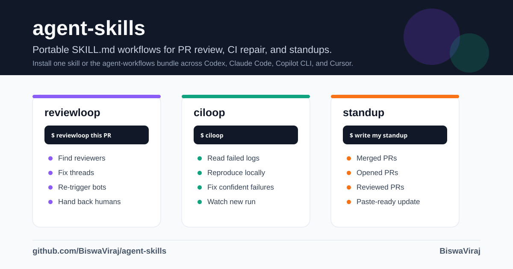
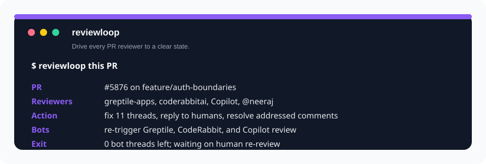
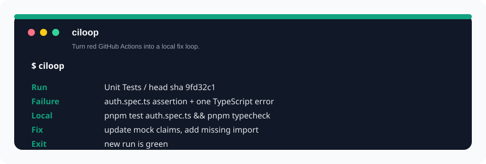
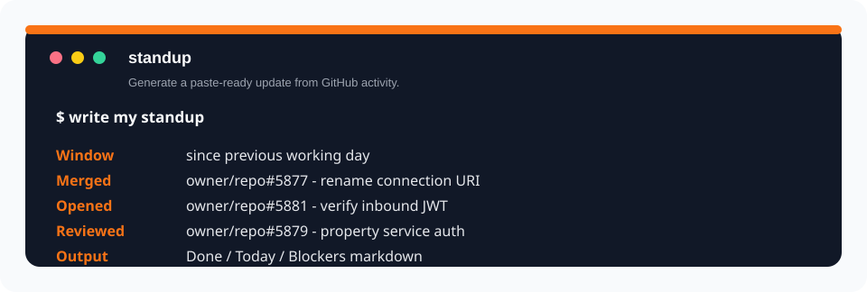

# agent-skills

> Portable agent workflows for coding agents: clear PR reviews, repair failing CI, and write standups from GitHub activity.




`agent-skills` is a small set of production-minded `SKILL.md` workflows by
[BiswaViraj](https://github.com/BiswaViraj). Author once, install across **Claude Code**,
**GitHub Copilot CLI**, **Codex**, and **Cursor** using the same source skills plus the right
per-agent plugin manifests.

The point is not "more prompts." The point is giving your coding agent durable operating loops for
the annoying parts around shipping code: scattered PR feedback, red CI, and daily status updates.

## What's Inside

| Skill | Use it when | What the agent does |
|---|---|---|
| **[reviewloop](skills/reviewloop/SKILL.md)** | A PR has feedback from several reviewers or bots. | Reads every unresolved review thread, fixes actionable comments, resolves/replies, re-triggers known bots, and loops until bot feedback is clear. Humans get one addressed pass and a re-review request. |
| **[ciloop](skills/ciloop/SKILL.md)** | GitHub Actions is red and you want it green. | Pulls the real failing logs, maps the failed workflow step to a local command, fixes only confidently reproducible failures, pushes once per iteration, and re-watches the matching run. |
| **[standup](skills/standup/SKILL.md)** | You need a daily or weekly standup update. | Uses your authenticated `gh` account to summarize merged, opened, and reviewed PRs into a paste-ready Done / Today / Blockers block. |

Install one skill if you want a focused setup, or install `agent-workflows` to get the full bundle.

## Quick Install

### Codex

Codex users can choose a single workflow or the bundle:

```bash
codex plugin marketplace add BiswaViraj/agent-skills

# Pick one:
codex plugin add reviewloop@biswaviraj-skills
codex plugin add ciloop@biswaviraj-skills
codex plugin add standup@biswaviraj-skills

# Or install all three:
codex plugin add agent-workflows@biswaviraj-skills
```

Codex also supports direct local skills under `$HOME/.agents/skills`, but plugins are the better
distribution path for this repo because they preserve install choices and marketplace metadata.

### Claude Code

Claude Code installs the bundle plugin:

```bash
claude plugin marketplace add BiswaViraj/agent-skills
claude plugin install agent-workflows@biswaviraj-skills
```

Or use [`@biswaviraj/cc-setup`](https://github.com/BiswaViraj/cc-setup), where this marketplace is in
the picker:

```bash
npx @biswaviraj/cc-setup@latest
```

### GitHub Copilot CLI

Copilot CLI shares the Claude Code marketplace/plugin flow:

```bash
copilot plugin marketplace add BiswaViraj/agent-skills
copilot plugin install agent-workflows@biswaviraj-skills
```

### Cursor

```bash
cursor plugin marketplace add BiswaViraj/agent-skills
cursor plugin install agent-workflows@biswaviraj-skills
```

## Demos

### reviewloop



Say:

```text
reviewloop this PR
```

Also triggers on: "clear all the reviews", "address every reviewer", "loop until the PR is clean".

### ciloop



Say:

```text
ciloop
```

Also triggers on: "fix the failing CI", "make the checks pass", "loop until CI is green".

### standup



Say:

```text
write my standup
```

Also triggers on: "what did I do since Friday", "what did I ship this week".

## Why These Are Useful

- **They encode stopping rules.** `reviewloop` knows when to keep looping on bots and when to hand
  back for humans. `ciloop` knows when a failure is not safe to guess at.
- **They use the source of truth.** Review state and CI failures come from GitHub via `gh`, not from
  stale chat context.
- **They stay agent-portable.** The reusable workflow lives in `SKILL.md`; plugin wrappers only adapt
  distribution for each harness.
- **They avoid workspace coupling.** No Slack, Linear, or company-specific connector is required.

## Requirements

- `git`
- GitHub CLI `gh`, authenticated to the repos you want the skills to operate on
- Installed review bots only if you want `reviewloop` to re-trigger them, such as Greptile,
  CodeRabbit, or Copilot review

## Repository Layout

```text
agent-skills/
├─ assets/              # README demo/social assets
├─ .agents/plugins/     # Codex marketplace.json (single skills + bundle)
├─ .claude-plugin/      # Claude Code + Copilot CLI compatibility marketplace
├─ .codex-plugin/       # Root Codex bundle manifest
├─ .cursor-plugin/      # Cursor plugin manifest
├─ plugins/             # Codex installable plugin packages
│  ├─ reviewloop/
│  │  ├─ .codex-plugin/plugin.json
│  │  └─ skills/reviewloop/
│  ├─ ciloop/
│  │  ├─ .codex-plugin/plugin.json
│  │  └─ skills/ciloop/
│  ├─ standup/
│  │  ├─ .codex-plugin/plugin.json
│  │  └─ skills/standup/
│  └─ agent-workflows/
│     ├─ .codex-plugin/plugin.json
│     └─ skills/{reviewloop,ciloop,standup}/
└─ skills/
   ├─ reviewloop/
   │  ├─ SKILL.md
   │  └─ references/github-mechanics.md
   ├─ ciloop/
   │  ├─ SKILL.md
   │  └─ references/gh-ci.md
   └─ standup/
      ├─ SKILL.md
      └─ standup.sh
```

## Developing A New Skill

Author the workflow under `skills/<name>/SKILL.md` first. Then package it for Codex by mirroring it
into `plugins/<name>/skills/<name>/`, adding `plugins/<name>/.codex-plugin/plugin.json`, mirroring it
into `plugins/agent-workflows/skills/<name>/` if it belongs in the bundle, and adding a marketplace
entry to `.agents/plugins/marketplace.json`.

For new Codex plugin scaffolds, Codex's `@plugin-creator` skill can generate the wrapper and
marketplace entry, then you can copy in the authored `SKILL.md`.

## Related

**The harnesses:** [Claude Code](https://code.claude.com/docs/en/skills) ·
[GitHub Copilot CLI](https://docs.github.com/en/copilot/how-tos/copilot-cli) ·
[Codex](https://developers.openai.com/codex/skills) · [Cursor](https://cursor.com)

**The review bots:** [Greptile](https://greptile.com) · [CodeRabbit](https://coderabbit.ai) ·
[GitHub Copilot code review](https://docs.github.com/copilot/using-github-copilot/code-review)

**The standard:** [Agent Skills](https://agentskills.io) — the open `SKILL.md` spec.

**See also:** [`@biswaviraj/cc-setup`](https://github.com/BiswaViraj/cc-setup) — one command to load
your plugins and MCP servers into a project.

## License

MIT © BiswaViraj
